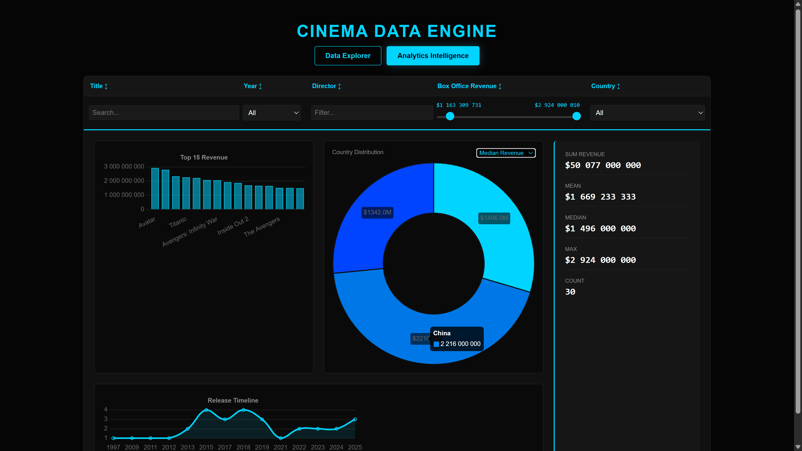
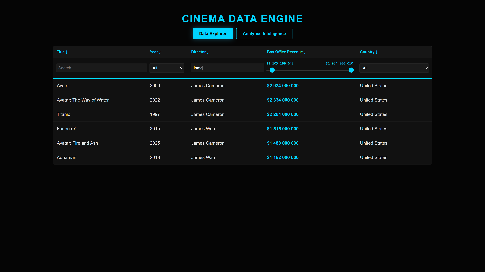

# Highest-Grossing Films - Data Wrangling & Visualization


## Project Overview

This project is part of the **Data Wrangling and Visualization** course at **Innopolis University**. It demonstrates the ability to extract, process, store, and visualize real-world data from unstructured sources.

The project parses the Wikipedia page on [Highest-Grossing Films](https://en.wikipedia.org/wiki/List_of_highest-grossing_films), extracts relevant film data, stores it in a SQLite database, and presents it through an interactive web page hosted on GitHub Pages.

---

## Live Demo

**GitHub Pages:** [https://canerig.github.io/DWaV-highest-grossing-films/](https://canerig.github.io/DWaV-highest-grossing-films/)

**Repository:** [https://github.com/CaneRig/DWaV-highest-grossing-films](https://github.com/CaneRig/DWaV-highest-grossing-films)

---

## Database Schema

```sql
CREATE TABLE IF NOT EXISTS films (
    id INTEGER PRIMARY KEY AUTOINCREMENT,
    title TEXT NOT NULL,
    release_year INTEGER,
    director TEXT,
    box_office DECIMAL(12, 2),
    country TEXT,
    CONSTRAINT uc_film UNIQUE (title, release_year, director, country)
);
```

### Data Fields Extracted

| Field | Type | Description |
|-------|------|-------------|
| `title` | TEXT | Film title |
| `release_year` | INTEGER | Year of release |
| `director` | TEXT | Director(s) name |
| `box_office` | DECIMAL | Box office revenue (USD) |
| `country` | TEXT | Country of origin |

---

## Project Structure

```
DWaV-highest-grossing-films/
├── data/
│   ├── films.db              # SQLite database
│   └── films.json            # Exported JSON for frontend
├── notebook/
│   └── data_extraction.ipynb # Jupyter Notebook for parsing
├── src/
│   ├── index.html            # Main HTML file
│   ├── styles.css            # CSS styling
│   └── script.js             # JavaScript logic
├── .gitignore
└── README.md
```

---

## Features

### Data Extraction
- [X] Automated web scraping from Wikipedia
- [X] Data cleaning and normalization
- [X] Currency symbol handling for box office values
- [X] Structured storage in SQLite database

### Web Interface
- [X] Responsive modern design
- [X] Film data table with sorting
- [X] Search/filter functionality
- [X] Dynamic data loading from JSON

---

## How to Run Locally

### Prerequisites
- Python 3.x
- Jupyter Notebook
- Required packages: in `requrements.txt`

### Installation

```bash
# Clone the repository
git clone https://github.com/CaneRig/DWaV-highest-grossing-films.git
cd DWaV-highest-grossing-films

# Create virtual environment
python -m venv venv

# Activate venv
./venv/Scripts/activate # For windows
source venv/bin/activate # Fro Linux

# Install dependencies
pip install -r requirements.txt

# [Optionally] Run the Jupyter Notebook for data extraction
jupyter notebook notebook/data_extraction.ipynb
```

### Viewing the Web Page

The page could be viewed on github pages: [https://canerig.github.io/DWaV-highest-grossing-films/](https://canerig.github.io/DWaV-highest-grossing-films/)
or ran locally: 

```bash
# Assumed that you are already in virtual enviroment
cd docs
fastapi run test\test-server.py
# visit localhost:8000/
```

---

## Data Source

**Primary Source:** [List of Highest-Grossing Films - Wikipedia](https://en.wikipedia.org/wiki/List_of_highest-grossing_films)

*Note: Data is subject to change as box office figures are updated regularly.*

---

## Assignment Completion Checklist

- [x] Parse Wikipedia page using Python (BeautifulSoup/Requests)
- [x] Extract film title, release year, director, box office, country
- [x] Store data in relational database (SQLite)
- [x] Export database to JSON for frontend consumption
- [x] Create interactive web page with HTML/CSS/JavaScript
- [x] Implement filtering/sorting features
- [x] Deploy to GitHub Pages
- [x] Document code with comments and markdown

---

## Screenshots

| Data explorer | Analytics Intelligance |
|-----------|---------------|
|  |  |

--- 

## License

This project is created for educational purposes as part of the Data Wrangling and Visualization course at Innopolis University.

---
